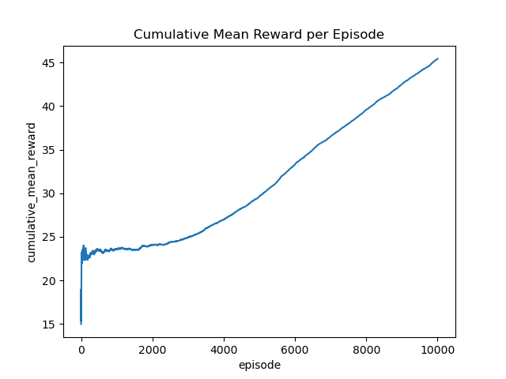
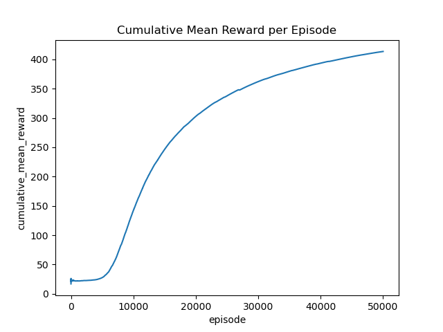
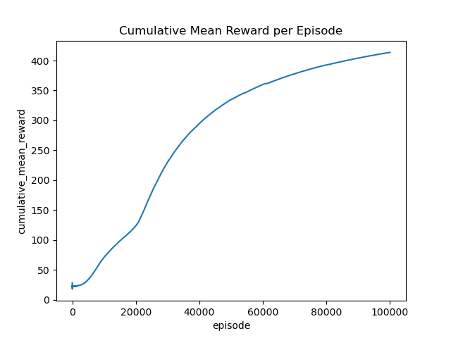

[](https://codecov.io/gh/baptisteSauv/reinforce)

# Reinforce Agent for the CartPole-v0 environment

This is a simple implementation of a reinforce agent for the CartPole-v0 environment. The agent is implemented in the reinforce object file. The `train.py` file contains the main loop for training the agent. 

## Usage

To train the agent, run the following command:

```bash
python train.py --n_episodes [NUMBER_OF_EPISODES] --model_path [MODEL_PATH]
```

## Results

The following plot shows the results of the agent after 10000, 50000 and 100000 episodes of training:





## References

- [Reinforcement Learning: An Introduction](http://incompleteideas.net/book/the-book-2nd.html)
- [OpenAI Gym](https://gym.openai.com/)
- [OpenAI Spinning Up](https://spinningup.openai.com/en/latest/)
- [OpenAI Spinning Up: Reinforce](https://spinningup.openai.com/en/latest/algorithms/reinforce.html)

## License

[MIT](LICENSE)

## Author

[Baptiste SAUVECANNE](https://baptistesauvecanne.fr)

## Disclaimer

This project is not affiliated with OpenAI in any way. OpenAI, OpenAI Gym, OpenAI Baselines, OpenAI Spinning Up, and the OpenAI logo are trademarks or registered trademarks of OpenAI, Inc. in the United States and other countries.

## Contact

If you have any questions, feel free to contact me at [contact@baptistesauvecanne.fr](mailto:contact@baptistesauvecanne.fr).